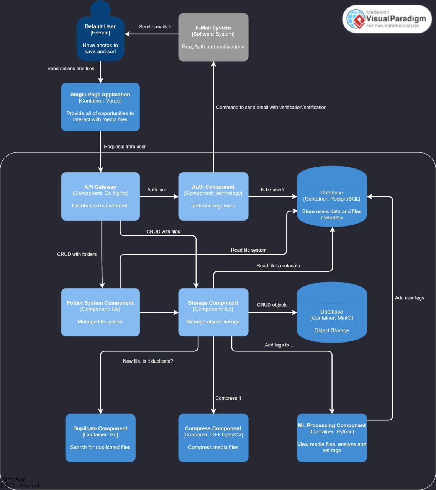

# Abstract High-level design и концептуальная модель данных
## Задание:
Дизайн «на салфетке» в виде крупных блоков (самостоятельно запускаемых частей системы) и стрелок, соединяющих эти блоки. Концептуальная модель данных должны отражать основные и очевидные сущности в системе, которые будут содержать больше всего данных (строки, BLOB).

## c4model уровень 3:
Более детализированный дизайн можно увидеть на этапе 6: [Concrete High-level design](https://github.com/Remy-Team/Remy-wiki/tree/main/Этап%206.%20Concrete%20High-level%20design)

## Концептуальная модель данных:
#### Сущности и их атрибуты
1. Пользователь (User)
	- ID пользователя
	- Имя пользователя
	- Электронная почта
	- Пароль (хэшированный)
	- Роль (например, обычный пользователь, администратор)
2. Медиафайл (MediaFile)
	- ID файла
	- ID пользователя (владельца файла)
	- Имя файла
	- Тип файла (фото, видео)
	- Размер файла
	- Дата загрузки
	- Путь к файлу в хранилище
	- Статус доступности (публичный, приватный, доступ по ссылке)
3. Тег (Tag)
	- ID тега
	- Название тега
4. Папка (Folder)
	- ID папки
	- ID родительской папки
	- ID пользователя (владельца)
	- Название папки
	- Дата создания
5. Подписка (Subscription)
	- ID подписки
	- ID пользователя
	- Тип подписки (например, базовый, премиум)
	- Дата начала
	- Дата окончания
	- Статус подписки (активна, истекла)
#### Взаимосвязи между сущностями
- Пользователь может иметь несколько Медиафайлов и несколько Папок.
- У каждой папки есть родительская папка, кроме корневой папки. Это формирует файловую структуру.
- Медиафайл может быть связан с несколькими Тегами, и один Тег может быть связан с несколькими Медиафайлами. Это отношение многие ко многим между Медиафайлами и Тегами.
- Папка содержит несколько Медиафайлов. Это отношение один ко многим между Папками и Медиафайлами.
- Пользователь может иметь только одну Подписку в любой момент времени. Это отношение один к одному между Пользователем и Подпиской.
