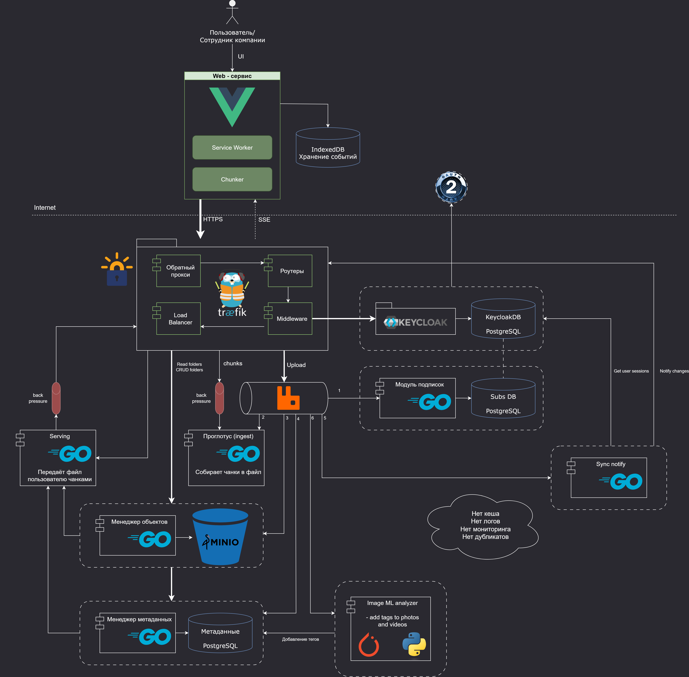

# Low-level design
## Задача
Данные этап должен отразить детализацию системы до уровня финального состава запускаемых компонентов (например, набор микросервисов) и middleware.
## Реализация
### Схема

# **В РАЗРАБОТКЕ** 
### Описание
Web-сервис
	Задачи:
		1. Пользовательский интерфейс для взаимодействия
		2. С ним можно взаимодействовать оффлайн, fat client
		3. Сохраняет события в свою базу данных при отсутствии соединения (IndexedDB) 
	Реализация: Vue.js
	Описание: Интерфейс пользователя, максимально повторяет интерфейс Finder или Explorer
Reverse Proxy + Load Balancer
	Задачи:
		1. Защита сервера.
		2. Балансировка нагрузки.
		3. Кэширование статических ресурсов.
		4. Кодирование и декодирование подключений SSL.
		5. API Gateway
	Реализация: Traefik 2.0

	Описание: Обратный прокси  реализованный с помощью traefik 2.0. Содержится в отдельно контейнере. Связан с keycloak для авторизации и аутентификации.
Авторизация
	Задачи:
		1. Single Sign-On
		2. авторизация в разных системах
		3. доступ к профилю пользователя
		Реализация: Keycloak
		Описание: содержится в отдельном контейнере, имеет свою базу данных PostgreSQL.
Ingest и Serving
	Задачи:
		1. Ingest: Проглатывает чанки, собирает их в файлы
		2. Serving: делит файлы на чанки и отправляет их пользователям
	Реализация:  Go
	Описание: Сервисы для скачивания с сервера и отправки файлов на сервер. В обоих случаях стоит предусмотреть back pressure.
Менеджер метаданных
	Задачи:
		1. Содержит метаданные о каждом файле каждого пользователя, например ссылку на объект в объектом хранилище и местоположение в файловой системе пользователя, имена и теги файлов, время создания и изменение и так далее.
		2. Организует и оптимизирует запросы к базе данных
	Реализация: Go
	Описание: Связывается с базой данных postgresql. Обрабатывает CRUD запросы  к файлам, папкам, тегам, и так далее. Возможно использование CQRS.
Менеджер объектов
	Задачи: 
		1. Организует взаимодействие с MinIO
		2. Достаёт и вставляет файлы в объектное хранилище
	Реализация: Go?
	Описание: Должен быть в отдельном контейнере, связан с менеджером метаданных, который связывает файловую структуру пользователя с объектной структурой хранилища объектов.
Модуль подписок
	Задачи:
		1. Проверка наличия подписки
		2. Проверка оставшегося места в хранилище в соответствии с тарифом
		3. Организация платежей, возможно
	Реализация: Go?
	Описание: Опрашивается при добавлении и удалении файлов, следит за соблюдением тарифного плана.
Модуль синхронизации
	Задачи: 
		1. Обеспечить синхронизацию изменений в хранилище между активными сессиями пользователя.
		2. Обеспечить синхронизацию при потерях соединения, актуализировать изменения при каждом событии 
	Реализация: Go?
	Описание: Обеспечивает синхронизацию событий между сессиями пользователей, чтобы при добавлении, удалении или изменениях файлов и папок изменения быстро применялись ко всем сессиям, а при добавлении сессий данные в них тоже актуализировались.
Модуль оповещений
	Задачи: 
		1. Оповещать пользователя о завершениях долгих операций, система сообщений событий
	Реализация: ?
	Описание: Нужен для оповещений по долгим событиям, например успешная загрузка файлов, конец процесса добавления тегов и так далее.
Модуль тего
	Задачи:
		1. Добавляет к новым загруженным файлам теги используя машинное обучение.
		2. Может повторно выполнить анализ для уточнения тегов
	Реализация: Python, BentoML
	Описание: Содержится в отдельном контейнере. Дополняется очередью задач, так как обработка файлов происходит долго
Очередь обработки событий
	Задачи:
		1. Обработка события добавления новых файлов. Это включает проверку подписки и свободного места, загрузка и объединение чанков, сохранение файла в объектное хранилище, сохранение метаданных, оповещение о успешной загрузке, добавление тегов
		2. Обработка других событий
	Реализация: RabbitMQ или Kafka
	Описание: Обрабатывает события, выполняя цепочку процессов обработки событий, обращаясь к различным микросервисам